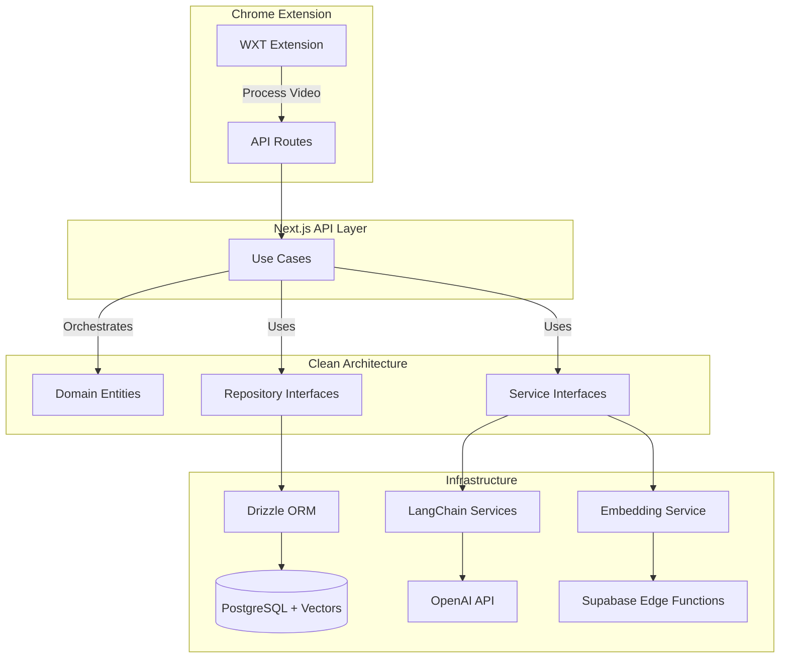

# Retenio

**An AI-powered learning platform that transforms passive YouTube watching into active learning through intelligent summaries, auto-generated quizzes, and scientifically-proven spaced repetition.**

[Live Demo](https://retenio.ai) | [Tech Stack](#tech-stack) | [Features](#features) | [Architecture](#architecture)

---

## Tech Stack

### Frontend

### Backend & Database

### AI & ML

### Chrome Extension

### DevOps

---

## Features

- **Chrome Extension** - Seamlessly captures YouTube videos as you browse
- **AI Summaries** - LangChain-powered comprehensive video summaries
- **Smart Quizzes** - Auto-generated multiple choice questions with source timestamps
- **Spaced Repetition** - 5-box Leitner system schedules reviews for optimal retention
- **Semantic Search** - Vector embeddings link quiz questions to exact video moments
- **Progress Tracking** - Dashboard shows mastery levels across all topics

---

## Architecture

This project implements **Clean Architecture** with clear separation between domain logic, use cases, and infrastructure:

### Key Architectural Decisions

| Decision | Rationale |
|----------|-----------|
| **Clean Architecture** | Decouples business logic from frameworks, making code testable and maintainable |
| **Dependency Injection** | All dependencies are injected, enabling easy testing and flexibility |
| **Interface-Based Design** | Program to abstractions - infrastructure can be swapped without changing business logic |
| **Hybrid RESTful/RPC API** | Action-based endpoints for operations, resource-based for CRUD - pragmatic over dogmatic |
| **Use Case Pattern** | Each operation is a single-purpose class with explicit dependencies |
| **JSend Response Format** | Standardized API responses (success/fail/error) for consistent client handling |
| **Cookie-Based Sessions** | Secure session management via Supabase Auth - automatic CSRF protection, no token storage |

---

**Built with passion for learning**

