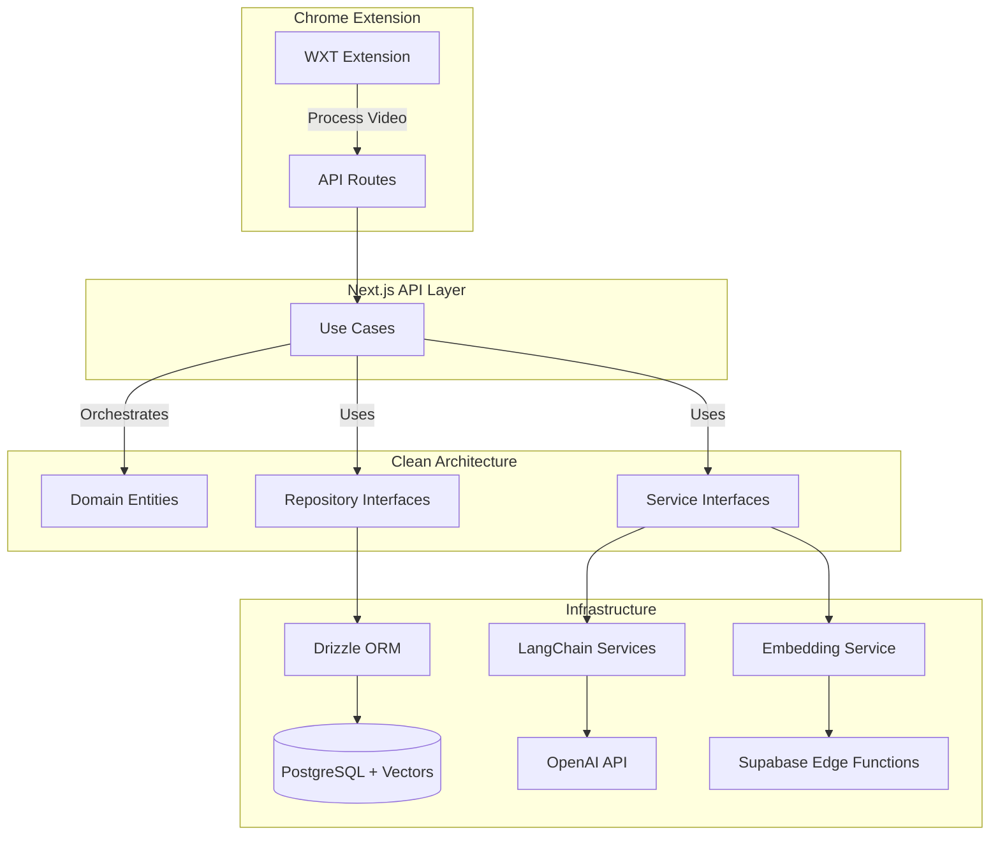

<div align="center">

[](https://recallai.io)

[](https://recallai.io)
[](https://www.typescriptlang.org/)
[](LICENSE)

**An AI-powered learning platform that transforms passive YouTube watching into active learning through intelligent summaries, auto-generated quizzes, and scientifically-proven spaced repetition.**

[Live Demo](https://recallai.io) | [Features](#features) | [Tech Stack](#tech-stack) | [Architecture](#architecture) | [Getting Started](#getting-started)

</div>

---

## The Problem

We watch hours of educational videos but retain almost nothing. Studies show we forget **70% of new information within 24 hours** without active recall practice.

## The Solution

RecallAI automatically processes YouTube videos you watch, generates AI-powered summaries and quiz questions, then uses the **Leitner box spaced repetition system** to schedule reviews at optimal intervals for long-term retention.

---

## Features

- **Chrome Extension** - Seamlessly captures YouTube videos as you browse
- **AI Summaries** - LangChain-powered comprehensive video summaries
- **Smart Quizzes** - Auto-generated multiple choice questions with source timestamps
- **Spaced Repetition** - 5-box Leitner system schedules reviews for optimal retention
- **Semantic Search** - Vector embeddings link quiz questions to exact video moments
- **Progress Tracking** - Dashboard shows mastery levels across all topics

---

## Tech Stack

<div align="center">

### Frontend


### Backend & Database


### AI & ML


### Chrome Extension


### DevOps


</div>

---

## Architecture

This project implements **Clean Architecture** with clear separation between domain logic, use cases, and infrastructure:



### Key Architectural Decisions

| Decision | Rationale |
|----------|-----------|
| **Clean Architecture** | Decouples business logic from frameworks, making code testable and maintainable |
| **Use Case Pattern** | Each operation is a single-purpose class with explicit dependencies |
| **Repository Interfaces** | Infrastructure can be swapped without changing business logic |
| **Dependency Injection** | All dependencies are injected, enabling easy testing and flexibility |

---

## AI/ML Deep Dive

### RAG Pipeline for Timestamp Matching

One of the most sophisticated features is matching AI-generated source quotes to exact video timestamps using vector similarity search:

```
1. LLM generates question with verbatim source quote from transcript
2. Quote is embedded into 384-dimensional vector (gte-small model)
3. Cosine similarity search finds most similar transcript window
4. Window's timestamp becomes the question's source timestamp
5. Users can click to jump to exact video moment
```

### Spaced Repetition Algorithm (Leitner System)

The platform implements the scientifically-proven Leitner box system:

```typescript
// 5-box intervals for optimal retention
const BOX_INTERVALS = {
  1: 1,   // Review in 1 day (struggling)
  2: 3,   // Review in 3 days
  3: 7,   // Review in 7 days
  4: 14,  // Review in 14 days
  5: 30,  // Review in 30 days (mastered)
};

// Correct answer: advance to next box
// Incorrect answer: reset to box 1
```

### LangChain Structured Outputs

All AI generations use type-safe structured outputs with Zod validation:

```typescript
const QuestionSchema = z.object({
  question: z.string(),
  options: z.array(z.string()).length(4),
  correctAnswerIndex: z.number().min(0).max(3),
  explanation: z.string(),
  sourceQuote: z.string(), // Exact quote from transcript
});

const model = new ChatOpenAI({ model: "gpt-4.1-nano" });
const structuredModel = model.withStructuredOutput(QuestionSchema);
```

---

## Code Highlights

### Vector Similarity Search

```typescript
// Find most similar transcript window using cosine distance
const similarity = sql<number>`1 - (${cosineDistance(
  transcriptWindows.embedding,
  queryEmbedding
)})`;

const [result] = await db
  .select({
    startTime: transcriptWindows.startTime,
    similarity
  })
  .from(transcriptWindows)
  .where(eq(transcriptWindows.videoId, videoId))
  .orderBy(desc(similarity))
  .limit(1);
```

### Clean Architecture Dependency Injection

```typescript
// Use case receives all dependencies via constructor
const useCase = new GenerateMultipleChoiceQuestionsUseCase(
  new DrizzleVideoRepository(),
  new DrizzleQuestionRepository(),
  new StrapiVideoTranscriptService(),
  new LangChainQuestionGeneratorService(),
  new MatchSourceQuoteTimestampUseCase(
    new SupabaseEmbeddingService(),
    new DrizzleTranscriptWindowRepository()
  )
);
```

---

## Project Structure

```
recallai/
├── web/                          # Next.js web application
│   ├── src/
│   │   ├── app/                  # App Router pages & API routes
│   │   ├── clean-architecture/
│   │   │   ├── domain/           # Entities & interfaces
│   │   │   ├── use-cases/        # Business logic orchestration
│   │   │   └── infrastructure/   # Drizzle repos & LangChain services
│   │   ├── drizzle/              # Schema, migrations, relations
│   │   └── components/           # React components
│   └── docs/                     # Architecture documentation
│
└── extension/                    # Chrome extension (WXT)
    ├── src/
    │   ├── entrypoints/          # Background worker & popup
    │   ├── hooks/                # React state management
    │   └── services/             # API communication
    └── wxt.config.ts             # Extension configuration
```

---

## Getting Started

### Prerequisites

- Node.js 18+
- PostgreSQL database (Supabase recommended)
- OpenAI API key

### Web Application

```bash
cd web
npm install
cp .env.example .env.local  # Configure environment variables
npm run db:migrate          # Run database migrations
npm run dev                 # Start development server
```

### Chrome Extension

```bash
cd extension
npm install
npm run dev     # Start with hot reload
npm run build   # Production build
```

### Environment Variables

```bash
# Supabase
NEXT_PUBLIC_SUPABASE_URL=
NEXT_PUBLIC_SUPABASE_ANON_KEY=
DATABASE_URL=

# OpenAI
OPENAI_API_KEY=
```

---

## Key Technical Achievements

| Feature | Implementation |
|---------|---------------|
| **Vector Embeddings** | 384-dim embeddings with pgvector for semantic search |
| **Structured AI Output** | LangChain + Zod for type-safe LLM responses |
| **Clean Architecture** | Domain-driven design with dependency inversion |
| **Spaced Repetition** | Evidence-based Leitner algorithm for retention |
| **Session Auth** | Cookie-based auth flow between extension and web |
| **Manifest V3** | Modern Chrome extension with service workers |

---

## Future Roadmap

- [ ] Mobile app (React Native)
- [ ] Support for additional video platforms
- [ ] Collaborative learning features
- [ ] Advanced analytics dashboard
- [ ] Browser extension for Firefox/Safari

---

## License

MIT License - feel free to use this project for learning or as inspiration for your own projects.

---

<div align="center">

**Built with passion for learning**

[](https://github.com/hhubert14)
[](https://www.linkedin.com/in/huberthuang1/)
[](https://huberthuang.vercel.app/)

</div>
